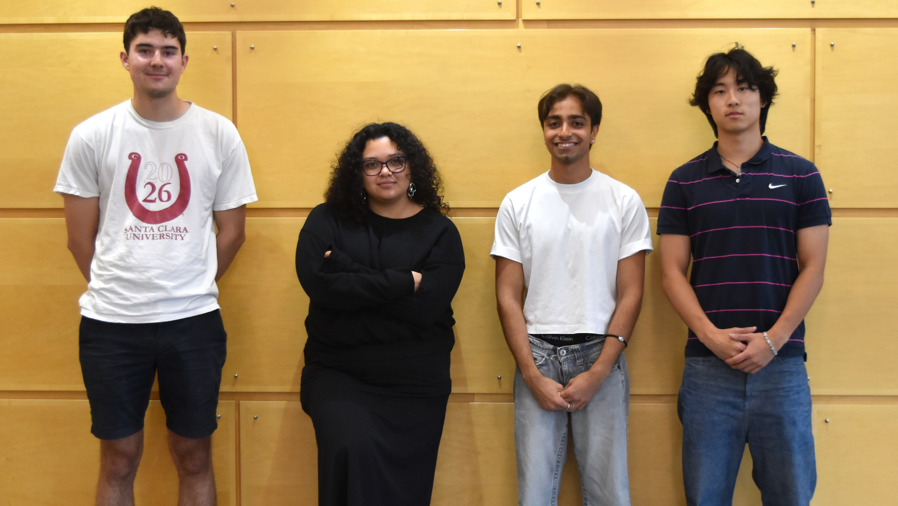

# Team_09 Dynamix II

This is my team

## Blurb

We will implement molecular dynamics (MD) algorithms on the latest CPUs, GPUs, and FPGAs to compare their performance. One project objective is to identify the most performant MD implementation and to understand how the hardware supports these results. We will speak with our client who oversaw last year’s MD project to further refine our project objectives and to ensure that we build on the previous group’s work.

## Team links
- [Team Google Drive](https://drive.google.com/drive/folders/1uDh5uxmoZppGSzFuEcW462L6dL4mUN0_?usp=drive_link)

## Course links
- [ECE Senior Design Piazza Site](https://piazza.com/bu/fall2025/ec463/home)
- [Blackboard](http://learn.bu.edu/)

## Optional features links
- Team Jira
- Team Confluence
- Something else

